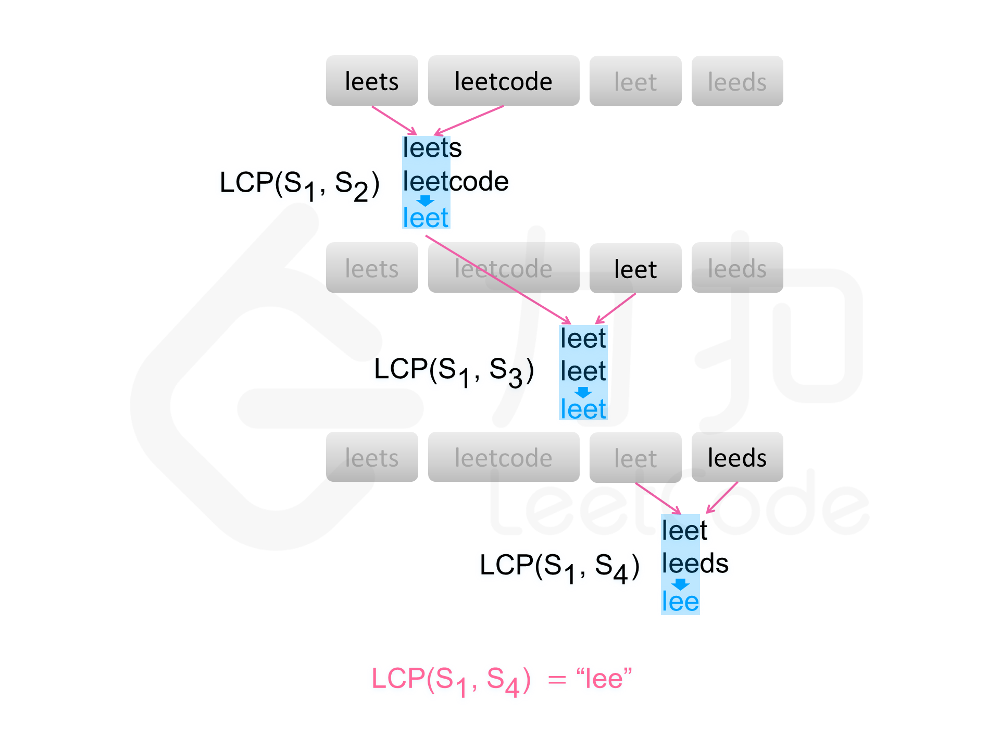

# 14 最长公共前缀

```text
编写一个函数来查找字符串数组中的最长公共前缀。 如果不存在公共前缀，返回空字符串 ""。 

示例 1:        输入: ["flower","flow","flight"]            输出: "fl"
示例 2:        输入: ["dog","racecar","car"]               输出: ""              解释: 输入不存在公共前缀。

说明: 
所有输入只包含小写字母 a-z 。 

Related Topics 字符串
```

[参考官网](https://leetcode-cn.com/problems/longest-common-prefix/solution/zui-chang-gong-gong-qian-zhui-by-leetcode-solution/)

## 方法一、横向扫描

思路：依次遍历字符串数组中的每个字符串，对于每个遍历到的字符串，更新最长公共前缀，当遍历完所有的字符串以后，即可得到字符串数组中的最长公共前缀。如果在尚未遍历完所有的字符串时，最长公共前缀已经是空串，则最长公共前缀一定是空串，因此不需要继续遍历剩下的字符串，直接返回空串即可。



```java
class Solution {
    public String longestCommonPrefix(String[] strs) {
        int len = strs.length;
        if(len==0) return "";
        String prefix = strs[0];
        for(int i=1; i<len; i++){
            prefix = longestCommonPrefix(prefix, strs[i]);
            if(prefix.length()==0){
                break;
            }
        }
        return prefix;
    }

    public String longestCommonPrefix(String str1, String str2){
        int length = Math.min(str1.length(), str2.length());
        int index = 0;
        while(index<length && str1.charAt(index)==str2.charAt(index)){
            index++;
        }
        return str1.substring(0,index);
    }
}
```

**复杂度分析**

* 时间复杂度：O\(mn\)，其中 m 是字符串数组中的字符串的平均长度，n 是字符串的数量。最坏情况下，字符串数组中的每个字符串的每个字符都会被比较一次。
* 空间复杂度：O\(1\)。使用的额外空间复杂度为常数。

## 方法二、纵向扫描

思路：纵向扫描时，从前往后遍历所有字符串的每一列，比较相同列上的字符是否相同，如果相同则继续对下一列进行比较，如果不相同则当前列不再属于公共前缀，当前列之前的部分为最长公共前缀。


```java
class Solution {
    public String longestCommonPrefix(String[] strs) {
        if (strs == null || strs.length == 0) {
            return "";
        }

        int length = strs[0].length();
        int count = strs.length;

        for(int i=0; i<length; i++){
            char c = strs[0].charAt(i);
            for(int j=1; j<count; j++){
                if( i==strs[j].length() || c!=strs[j].charAt(i)){
                    return strs[0].substring(0,i);
                }
            }
        }
        return strs[0];
    }
}
```

**复杂度分析**

* 时间复杂度：O\(mn\)，其中 m 是字符串数组中的字符串的平均长度，n 是字符串的数量。最坏情况下，字符串数组中的每个字符串的每个字符都会被比较一次。
* 空间复杂度：O\(1\)。使用的额外空间复杂度为常数。

## 方法三、分治

思路：设 $$LCP(S_1...S_n)$$ 是字符串 $$S_1...S_n$$ 的最长公共前缀。满足结合律：$$LCP(S_1...S_n)=LCP(LCP(S_1...S_K),LCP(S_{K+1}...S_n))$$。因此可以使用分治法得到字符串数组中的最长公共前缀。将问题 $$LCP(S_i...S_j)$$ 分解为 $$LCP(S_i...S_{mid})$$ 与 $$LCP(S_{mid}...S_j)$$，其中$$S_{mid}=(i+j)/2$$。对两个子问题分别求解，然后对两个子问题的解计算最长公共前缀，即为原问题的解。


```java
class Solution {
    public String longestCommonPrefix(String[] strs) {
        if (strs == null || strs.length == 0) {
            return "";
        } else {
            return longestCommonPrefix(strs, 0, strs.length - 1);
        }
    }

    public String longestCommonPrefix(String[] strs, int start, int end) {
        if (start == end) {
            return strs[start];
        } else {
            int mid = (end - start) / 2 + start;
            String lcpLeft = longestCommonPrefix(strs, start, mid);
            String lcpRight = longestCommonPrefix(strs, mid + 1, end);
            return commonPrefix(lcpLeft, lcpRight);
        }
    }

    public String commonPrefix(String lcpLeft, String lcpRight) {
        int minLength = Math.min(lcpLeft.length(), lcpRight.length());       
        for (int i = 0; i < minLength; i++) {
            if (lcpLeft.charAt(i) != lcpRight.charAt(i)) {
                return lcpLeft.substring(0, i);
            }
        }
        return lcpLeft.substring(0, minLength);
    }
}
```

**复杂度分析**

* 时间复杂度：O\(mn\)，其中 m 是字符串数组中的字符串的平均长度，n 是字符串的数量。时间复杂度的递推式是 T\(n\)=2\*T\(n/2\)+O\(m\)，通过计算可得 T\(n\)=O\(mn\)。
* 空间复杂度：O\(mlogn\)，其中 m 是字符串数组中的字符串的平均长度，n 是字符串的数量。空间复杂度主要取决于递归调用的层数，层数最大为 logn，每层需要 m 的空间存储返回结果。

## 方法四、二分查找

最长公共前缀的长度不会超过字符串数组中的**最短**字符串的长度。用 minLength 表示字符串数组中的最短字符串的长度，则可以在 \[0,minLength\] 的范围内通过**二分查找**得到最长公共前缀的长度。每次取查找范围的中间值 mid，判断每个字符串的长度为 mid 的前缀是否相同，如果相同则最长公共前缀的长度一定大于或等于 mid，如果不相同则最长公共前缀的长度一定小于 mid，通过上述方式将查找范围缩小一半，直到得到最长公共前缀的长度。


```java
class Solution {
    public String longestCommonPrefix(String[] strs) {
        if (strs == null || strs.length == 0) {
            return "";
        }
        int minLength = Integer.MAX_VALUE;
        for (String str : strs) {
            minLength = Math.min(minLength, str.length());
        }
        int low = 0, high = minLength;
        while (low < high) {
            int mid = (high - low + 1) / 2 + low;
            if (isCommonPrefix(strs, mid)) {
                low = mid;
            } else {
                high = mid - 1;
            }
        }
        return strs[0].substring(0, low);
    }

    public boolean isCommonPrefix(String[] strs, int length) {
        String str0 = strs[0].substring(0, length);
        int count = strs.length;
        for (int i = 1; i < count; i++) {
            String str = strs[i];
            for (int j = 0; j < length; j++) {
                if (str0.charAt(j) != str.charAt(j)) {
                    return false;
                }
            }
        }
        return true;
    }
}
```

**复杂度分析**

* 时间复杂度：O\(mnlogm\)，其中 m 是字符串数组中的字符串的最小长度，n 是字符串的数量。二分查找的迭代执行次数是O\(logm\)，每次迭代最多需要比较 mn 个字符，因此总时间复杂度是 O\(mnlogm\)。
* 空间复杂度：O\(1\)。使用的额外空间复杂度为常数。

