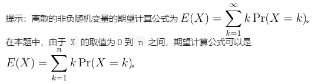
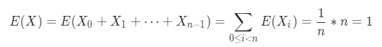

# LCP 11 期望个数统计🔹

```text
某互联网公司一年一度的春招开始了，一共有 n 名面试者入选。每名面试者都会提交一份简历，公司会根据提供的简历资料产生一个预估的能力值，数值越大代表越有可能通过面试。 
小 A 和小 B 负责审核面试者，他们均有所有面试者的简历，并且将各自根据面试者能力值从大到小的顺序浏览。由于简历事先被打乱过，能力值相同的简历的出现顺序是从它们的全排列中等可能地取一个。
现在给定 n 名面试者的能力值 scores，设 X 代表小 A 和小 B 的浏览顺序中出现在同一位置的简历数，求 X 的期望。 
提示：离散的非负随机变量的期望计算公式为 。在本题中，由于 X 的取值为 0 到 n 之间，期望计算公式可以是 。 

示例 1： 
输入：scores = [1,2,3] 
输出：3 
解释：由于面试者能力值互不相同，小 A 和小 B 的浏览顺序一定是相同的。X的期望是 3 。 

示例 2： 
输入：scores = [1,1] 
输出：1 
解释：设两位面试者的编号为 0, 1。由于他们的能力值都是 1，小 A 和小 B 的浏览顺序都为从全排列 [[0,1],[1,0]] 中等可能地取一个。如果小 A 和小 B 的浏览顺序都是 [0,1] 或者 [1,0] ，那么出现在同一位置的简历数为 2 ，否则是 0 。所以 X 的期望是 (2+0+2+0) * 1/4 = 1 

示例 3： 
输入：scores = [1,1,2] 
输出：2 

限制： 
1 <= scores.length <= 10^5 
0 <= scores[i] <= 10^6
```



不同能力值的简历是不会互相影响的，所以问题可以简化为有一个长度为 n 的的数组，将里面的元素按照全排列随机排序后，问有多少个元素还在原位。设这个随机变量为 X ，并且设 X\_i 是第 i 个元素还在原位的 0-1 变量，即如果第 i 个元素还在原位， X\_i = 1 ，否则 X\_i = 0。每一个元素随机排序后还在原位的概率是 1/n。

由期望的可加性，可以得到：



发现 E\(X\) 跟数组元素的长度无关，所以只需要求这个数组中的不同数字的个数即可。

```java
class Solution {
    public int expectNumber(int[] scores) {
        HashSet<Integer> odds = new HashSet<Integer>();
        for (int i = 0; i < scores.length; i++) {
            odds.add(scores[i]);
        }
        return odds.size();
    }
}
```

